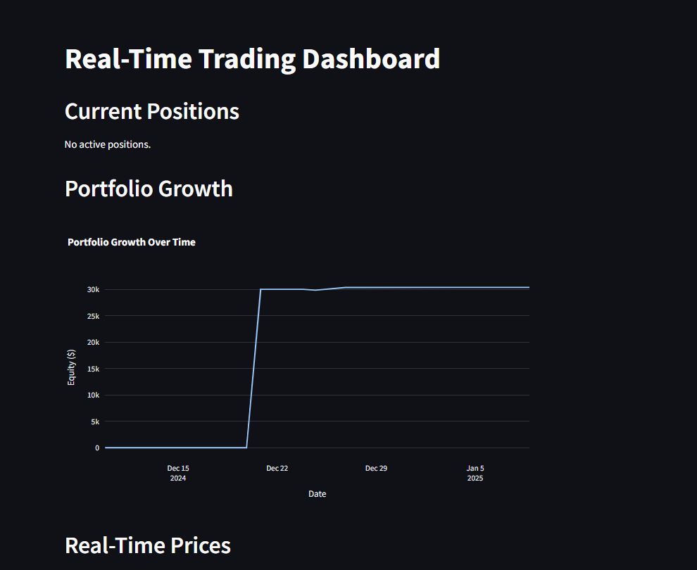
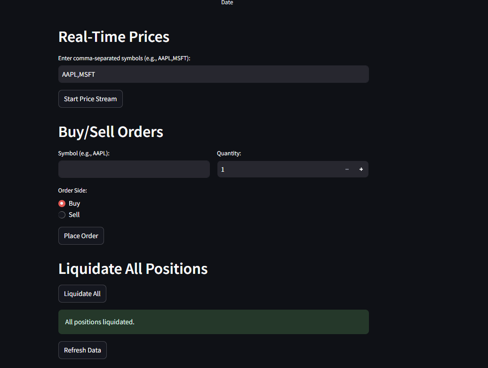

# Real-Time Trading Dashboard

A simple, real-time trading dashboard built with [Streamlit](https://streamlit.io/) and [Alpaca](https://alpaca.markets/) APIs. This application allows users to view current positions, monitor portfolio growth, stream real-time market prices, place buy/sell orders, and liquidate all positions through Alpaca’s paper trading endpoint.

## Features

1. **View Current Positions**  
   Displays your current Alpaca positions, including symbol, quantity, market value, cost basis, and unrealized P/L.

2. **Portfolio Growth Chart**  
   Provides a quick view of your portfolio’s equity growth over time using Plotly.

3. **Real-Time Price Updates**  
   Streams live prices for any comma-separated symbols (e.g., `AAPL,MSFT`) via Alpaca’s WebSocket connections.

4. **Buy/Sell Orders**  
   Place simple market orders for any symbol and quantity.

5. **Liquidate All Positions**  
   Quickly close all open positions.

6. **Refresh Data**  
   Reload the dashboard to update positions and portfolio data on demand.




---

## Getting Started

### Prerequisites

- Python 3.7+
- An Alpaca account with paper trading enabled (obtain your paper trading API key and secret).

### Installation

1. **Clone or Download the Repository**

   ```bash
   git clone https://github.com/yourusername/your-repo.git
   cd your-repo
   ```

2. **Create and Activate a Virtual Environment (Optional but Recommended)**

   ```bash
   python -m venv venv
   source venv/bin/activate  # On macOS/Linux
   venv\Scripts\activate     # On Windows
   ```

3. **Install Dependencies**

   ```bash
   pip install -r requirements.txt
   ```

   If you don’t have a `requirements.txt` file yet, you can create one with the libraries used:

   ```bash
   pip install streamlit alpaca-trade-api plotly pandas
   pip freeze > requirements.txt
   ```

4. **Configure Alpaca API Credentials**

   Replace `API_KEY`, `SECRET_KEY`, and `BASE_URL` in the code with your own keys (or, better yet, load them from environment variables):

   ```python
   API_KEY = "YOUR_API_KEY"
   SECRET_KEY = "YOUR_SECRET_KEY"
   BASE_URL = "https://paper-api.alpaca.markets"
   ```

   Ensure your trading account is set up for paper trading if you want to avoid real trades.

---

## Usage

### Run the Streamlit App

```bash
streamlit run d.py
```

or whatever filename you have (e.g., `app.py`).

### Interact with the Dashboard

- **Current Positions:** Shows positions in your Alpaca paper trading account.
- **Portfolio Growth:** A time-series chart of your equity over the last month.
- **Real-Time Prices:**
  - Type in symbols (e.g., `AAPL,MSFT`) and click “Start Price Stream” to begin receiving live data.
  - Once data starts streaming, prices update in real-time on the dashboard.
- **Buy/Sell Orders:**
  - Enter a symbol (e.g., `AAPL`), set the quantity, choose Buy or Sell, and click “Place Order.”
  - Check for success or error messages.
- **Liquidate All Positions:**
  - Click the “Liquidate All” button to close all open positions immediately.
- **Refresh Data:**
  - Click “Refresh Data” to re-fetch your portfolio positions and history.

---

## Project Structure

```bash
your-repo/
  ├─ d.py                  # Main Streamlit app (or app.py, whichever you named it)
  ├─ requirements.txt      # Python dependencies
  └─ README.md             # This file
```

---

## Screenshots

<details> <summary><strong>Dashboard Overview</strong></summary>

Example of the “Current Positions” and “Portfolio Growth” sections.

</details>

<details> <summary><strong>Price Stream & Orders</strong></summary>

Example of the “Real-Time Prices,” “Buy/Sell Orders,” and “Liquidate All Positions” sections.

</details>

(Replace these with your actual screenshot file paths or remove if you prefer.)

---

## Troubleshooting

### WebSocket Connection Fails

- Ensure your API credentials are correct and that your network allows WebSocket connections.
- Verify that you’re using the correct `data_feed` (either `iex` or `sip`, depending on your subscription level).

### Orders Not Executing

- Make sure the market is open, or consider placing orders with extended-hours attributes.
- Double-check your paper trading balance and settings.

### Cannot Import Alpaca Modules

- Check your Python environment to confirm `alpaca-trade-api` is installed.
- Run `pip show alpaca-trade-api` to confirm.

---

## Contributing

Contributions are welcome! Feel free to open issues or pull requests to improve or expand this project.

1. Fork the Repository.
2. Create your feature branch:

   ```bash
   git checkout -b feature/new-feature
   ```

3. Commit your changes:

   ```bash
   git commit -m "Add new feature"
   ```

4. Push to the branch:

   ```bash
   git push origin feature/new-feature
   ```

5. Open a new pull request.

---

## License

This project is provided under the MIT License. You are free to modify and distribute this project as long as the original license is included.

---

## Disclaimer

This project is for educational purposes only and not financial advice. Use at your own risk. Always verify API credentials and ensure you are using a paper trading account to avoid unintended real trades.

